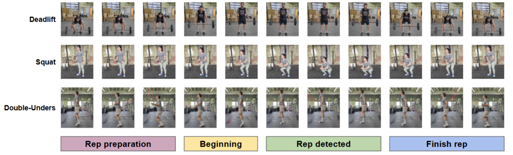

# CFRep

## Introduction to the dataset
CFRep is an open-access video dataset designed for rep-based exercise validation for functional fitness settings. The dataset attempts to alleviate the limited quantity of free access, carefully labeled data for movement evaluation quality and repetition accuracy inside functional fitness scenarios.



## Data Preparation

- Recorded videos in three distinct camera angles: front, diagonal, and side.
- Emulated point-of-view conditions present in competitions.
- **Deadlift**:
  - Selected due to frequent debates in the community.
  - Barbell use challenges pose estimation models depending on the angle.
- **Squat**:
  - Chosen for frequent contesting and cleaner execution.
  - Helped improve comprehension of angle variations.
- **Double-unders**:
  - Chosen for coordination difficulty and frequent presence in fitness competitions.
- Videos were trimmed and labeled for clear identification between evaluated categories.

## Annotation Collection

- Labeled each repetition as valid (1) or invalid (0) based on the official functional fitness rulebook.
- Annotations performed by a certified CrossFit Judge and L1 Trainer with 1.5 years of coaching experience.
- **Deadlift invalid if**:
  - Barbell does not start from the ground.
  - Lift is not completed with full hip and knee extension.
  - Athlete intentionally bounces the plates.
- **Air squat invalid if**:
  - Hips do not descend below the knees.
  - Movement lacks full extension at the top.
- **Double under invalid if**:
  - Rope fails to pass under the feet twice during a single jump.

## Dataset Statistics

- CFRep comprises **64 videos**.
- Data collected from **8 participants** (4 male, 4 female).
- Exercises: **deadlift, double-unders, squat**.
- Three different camera angles used.
- Total repetitions:
  - **258 deadlift**
  - **328 double-unders**
  - **270 squat**
- Each video: 10 to 25 reps, both valid and invalid.
- Each rep annotated individually as **rep** or **no-rep**.
- Annotations follow official judging standards.
- Rep-wise annotation stored in a CSV `rep label` field.
- Enables evaluation using metrics: **accuracy, precision, recall, F1-score**.

### CFRep Dataset Construction

| Exercise       |        | Videos per Camera Angle       |       | Total | Reps |
|----------------|----------------------------------|-------|-------|--------|------|
|                | Front                           | Diag  | Side  |        |      |
| Deadlift       | 7                                | 7     | 7     | 21     | 258  |
| Double-unders  | 7                                | 7     | 7     | 21     | 328  |
| Squat          | 7                                | 7     | 8     | 22     | 270  |
| **Total**      | **21**                           | **21**| **22**| **64** | **856** |


## Dataset Properties

- Developed to evaluate rep-validation systems under challenging conditions.
- Key properties:
  - **Variance in camera angles**
  - **Inter-subject biomechanics**
  - **Execution degradation due to fatigue**
- Supports:
  - Studies on exercise quality assessment.
  - Automated judging systems.
  - Lightweight fitness tracking on edge devices.

## Video Pose Repetition Labellers

Two desktop tools are available for creating and editing repetition annotations. Both follow the same state sequence derived from the binary label (`prep` → `rep`/`no-rep` blocks → `finish`) and propagate the saved `annotations` back into every JSON file associated with the selected sample.

### Tkinter + OpenCV interface (recommended)

Run the Tkinter application from the project root:

```bash
python video_pose_labeller.py
```

Select the `json_keypoints` directory when prompted (defaults to `CFRep/json_keypoints` if it exists). Choose an exercise, pick a sample, and use the transport controls to play/pause, step frames, or scrub via the slider. Press **Mark end of current state** to commit each phase, **Undo last mark** to roll back mistakes, and **Save annotations** to write the final segments (including the auto-assigned `finish`) to all 11 JSON files for that sample. Existing annotations are detected automatically so you can review them or clear and start over.

### PyQt5 interface

`video_pose_labeller_qt.py` remains available if you prefer the PyQt5-based UI that ships with the dataset. Its workflow mirrors the Tkinter tool.


### Citation
If you find ARMBench useful, please considering citing our work:
```

@article{alves2025repval,
  title={RepVal: A Skeleton-based Validation System for Functional Fitness Repetition on Edge Devices},
  author={Alves, Lucas and Li, Fan and Xu, Lanyu},
  booktitle={2025 ACM/IEEE Symposium on Edge Computing (SEC)},
  year={2025}
}
```
